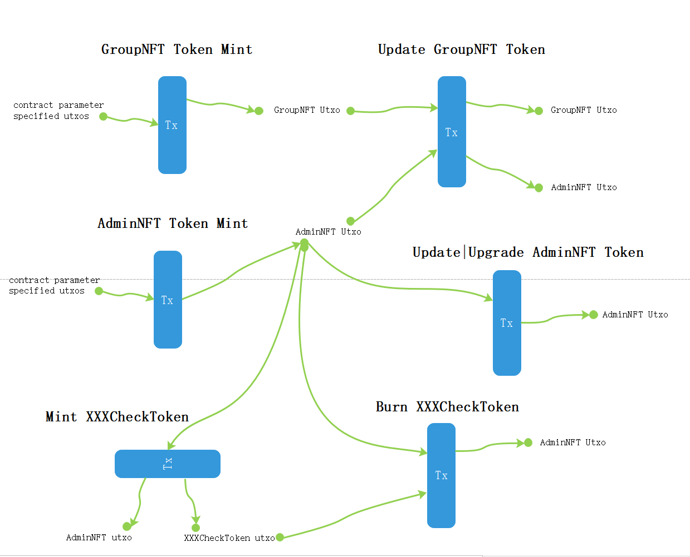
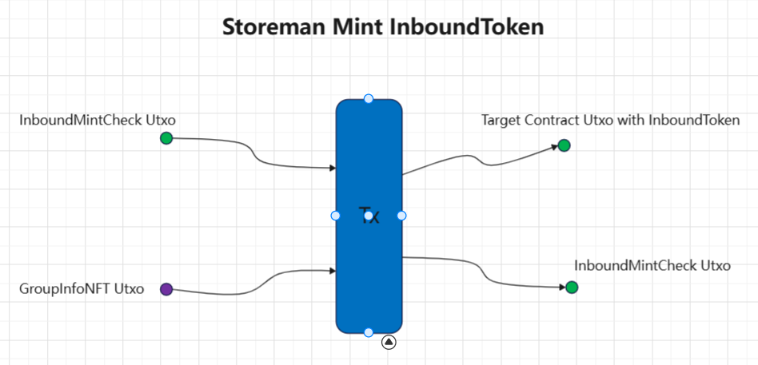
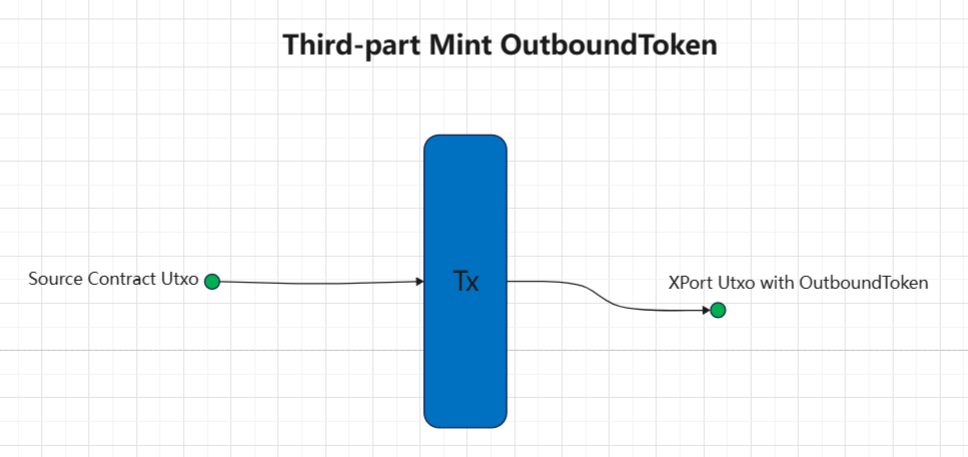

# Contracts Description
* #### GroupNFT
     Responsible to mint a NFT Token such as GroupNFTToken and AdminNFTToken. 
* #### GroupNFTToken
    GroupNFTToken stores important parameters for crosschain ,such as GPK, in inline datum
* #### AdminNFTToken
    AdminNFTToken stores Administator parameters ,such as all Administators's PK of and the Authorization thresholds, in inline datum

* ### GroupNFTHolder
    The contract holds the GroupNFT.

* ### InboundToken
    Responsible to mint InboundToken which represent a inbound msg from other chain,the asset name is a unique parameter which prepresent the remote origin contract.

* ### CheckToken
    Responsible to mint CheckToken which represent a certain type of permission which is determined by the XXXCheck contract. ,such as InboundCheckToken <--> InboundMintCheck

* ### InboundMintCheck
    The contract holds the InboundCheckToken minted via CheckToken, is responsible for Mint operation of InboundToken is authorized. 

* ### OutboundToken
    Responsible to mint OutboundToken which represent a outbound msg to other chain,the asset name is a fixed value.

* ### XPort
    The contract holds the OutboundToken minted via OutboundToken, and each OutboundToken is bound to a datum containing outbound msg. 
      
<br />
<br />

# Scenario Description

|Scenario||Input|Referece Input|Output|Validator Rules|
| --------------------------------------------| ----------------------------------------| ------------------------------------------------------------| ---------------------------| ---------------------------------------------------------------------------------------------------------------------------| -----------------------------------------------------------------------------------------------------------------------------------------------------------------------------------------------------------------------------------------------------------------------------------------------------------------------------------------------------------------------------------------------------------------------------------|
|Management Tx<br />|Mint GroupNFT Token|1. utxo which is specified by the contract parameters||1. utxo with GroupNFT Token (whose owner is usually the GroupNFTHolder)|1. must spend the utxo which is specified by GroupNFT ‘s parameter|
||Update GroupNFT Token|1. utxo with GroupNFT Token||1. utxo with GroupInfoNFT Token|1. must spend utxo with AdminNFT when update any one of the parameters or signed by oracle-worker when update GPK.<br />2. update only one of the parameter at a time except when setting a new version(upgrading the GroupNFTHolder contract)<br />3. check the owner of GroupNFT is not changed except when setting a new version.|
||Mint AdminNFT Token|1.utxo which is specified by the contract parameters||1.utxo with AdminNFT Token (whose owner is usually the AdminNFTHolder)|1. must spend the utxo which is specified by GroupNFT‘s parameter( an another utxo is different with in Mint GrouNFT )|
||Spend AdminNFT Token|1. utxo with AdminNFT Token||1. utxo with AdminNFT Token|1. satisfies m/n multi-signatures<br />2. check AdminNFT in outputs:<br />       i) if action is Update ,check the new datum of the AdminNFT is valid. And the owner is AdminNFTHolder<br />      ii) if action is Use , check the datum of the AdminNFT is not changed.And the owner is AdminNFTHolder<br />      iii) if action is Upgrade ,the owner of AdminNFT must be a contract|
||Mint XXXCheckToken|1.utxo with AdminNFT Token||1.utxo with AdminNFT <br />|1. must spend AdminNFT<br />2. check the owner of XXXCheckToken in outputs:<br />    i) TreasuryCheckToken is owner By TreasuryCheck<br />    ii) MintCheckToken is owner By MintCheck<br />    iii) NFTTreasuryCheckToken is owner By NFTTreasuryCheck<br />    iiii) NFTMintCheckToken is owner By NFTMintCheck<br />3. check the amount of XXXCheckToken in each utxo is no bigger than 1|
||Burn XXXCheckToken|1.utxo with AdminNFT Token||1.utxo with AdminNFT|1. must spend AdminNFT<br />2. check all XXXCheckToken has been burned|
||Operations about Stake|1.utxo with AdminNFT Token||1.utxo with AdminNFT<br />2. utxo owner by StackCheck if needed|1. must spend AdminNFT<br />2. check one of the outputs owner by StackCheck if redeemer is SpendU.|
|||||||
|Storeman Tx|InboundToken Mint: msg@EVM => msg@ADA|1. utxo with InboundCheckToken owner by InboundMintCheck<br />|1. utxo with GroupInfoNFT|1. utxo with InboundToken, owned by the third-part contract<br />2. utxo with InboundCheckToken, owned by InboundMintCheck <br />|1. check the redeemer is signed by MPC<br />2. check the tx  must spend the utxo specified by the redeemer<br />3. check the Minted InboundToken amount is 1 <br />4. check the InboundToken received by the target address specified by the redeemer.<br />5. check the tx is not expired.<br />6.  check the owner of TresuryCheckToken is still the TreasuryCheck.<br />7. check the datum of the target's output is the msg specified by redeemer<br /><br />|
|User Tx|OutboundToken Mint: msg@ADA => msg@EVM|1. utxos of the third-part contract|1. utxo with GroupInfoNFT|1. utxo with OutboundToken, owned by XPort<br />|1. must mint only 1 OutboundToken to Xport,and the output must has a datum containing cross-msg<br />2. must spend a utxo of the third-part contract, and the third-part contract address is the source address speicify by the cross-msg datum.<br /><br />|
|||||||

<br />





# How to compile

## 1. prepare compile environment (with nix-shell )
```shell
git clone https://github.com/IntersectMBO/plutus-apps.git
cd plutus-apps
git checkout v1.0.0-alpha1
nix-shell --extra-experimental-features flakes
```

## 2. compile contract

```shell
cd {project_path}/cross-chain
nix --extra-experimental-features "nix-command flakes" run .#cross-chain:exe:cross-chain --print-build-logs
```

## 3. compile result
All contracts compilecode is in {project_path}/cross-chain/generated-plutus-scripts